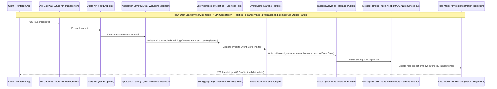

# 👤 TC Cloud Games - Users Service

The Users microservice is responsible for user management, authentication, authorization, and access control for the TC Cloud Games platform. It implements Event Sourcing for complete audit trails and provides JWT-based authentication.

## 🏗️ Architecture Overview

This service follows **Hexagonal Architecture (Ports & Adapters)** with **Domain-Driven Design (DDD)** and **Event Sourcing**:

````
TC.CloudGames.Users/
├── 🎯 Core/ # Business Logic
│ ├── Domain/ # Domain Layer
│ │ ├── Aggregates/ # UserAggregate
│ │ ├── ValueObjects/ # Email, Password, Role
│ │ └── Abstractions/ # Domain Interfaces
│ └── Application/ # Application Layer
│ ├── UseCases/ # CQRS Commands & Queries
│ ├── Ports/ # Application Interfaces
│ └── Mappers/ # DTO Mappers
├── 🔌 Adapters/ # Infrastructure & API
│ ├── Inbound/ # API Layer
│ │ └── TC.CloudGames.Users.Api/ # REST API Endpoints
│ └── Outbound/ # Infrastructure Layer
│ └── TC.CloudGames.Users.Infrastructure/ # Database & Repositories
└── 🧪 test/ # Comprehensive Test Suite
└── TC.CloudGames.Users.Unit.Tests/
├── 1 - Unit.Testing/ # Domain & Application Tests
├── 2 - Architecture.Testing/ # Architecture Validation
├── 3 - Integration.Testing/ # Integration Tests
└── 4 - BDD.Testing/ # Behavior-Driven Tests
````

### 🔀 User Registration Flow (Event Sourcing + Outbox)

This sequence diagram details the creation of a new user, applying Event Sourcing and the Transactional Outbox Pattern to ensure atomicity between event persistence and message publishing.


---

## 🎯 Domain Model

### Core Aggregate

#### 👤 UserAggregate
The main aggregate representing a user in the system with Event Sourcing:

```csharp
public sealed class UserAggregate : BaseAggregateRoot
{
    public string Name { get; private set; }
    public Email Email { get; private set; }
    public string Username { get; private set; }
    public Password PasswordHash { get; private set; }
    public Role Role { get; private set; }
    public bool IsActive { get; private set; }
    public DateTimeOffset CreatedAt { get; private set; }
    public DateTimeOffset? UpdatedAt { get; private set; }
}
```

**Key Features:**
- **Event Sourcing**: Complete audit trail of all user changes
- **Immutability**: State changes only through domain events
- **Validation**: Comprehensive business rule validation
- **Factory Methods**: Multiple creation strategies

### Value Objects

#### 📧 Email
Validated email address with normalization:

```csharp
public sealed record Email
{
    public string Value { get; }
    
    // Validation: Format, length, normalization
    public static Result<Email> Create(string value)
    
    // Business rules: RFC-compliant format, max 200 chars
    private static readonly Regex EmailRegex = new(
        @"^[a-zA-Z0-9._%+-]+@[a-zA-Z0-9.-]+\.[a-zA-Z]{2,}$",
        RegexOptions.Compiled | RegexOptions.IgnoreCase);
}
```

#### 🔐 Password
Secure password handling with hashing:

```csharp
public sealed record Password
{
    public string Hash { get; }
    
    // Security: BCrypt hashing, strength validation
    public static Result<Password> Create(string plainPassword)
    
    // Validation: Min length, complexity requirements
    // Hashing: BCrypt with salt
}
```

#### 👑 Role
Role-based access control with predefined roles:

```csharp
public sealed record Role
{
    public string Value { get; }
    
    // Predefined roles
    public static readonly Role User = new("User");
    public static readonly Role Admin = new("Admin");
    public static readonly Role Moderator = new("Moderator");
    
    // Business methods
    public bool IsAdmin() => Value.Equals("Admin", StringComparison.OrdinalIgnoreCase);
    public bool CanModerate() => IsAdmin() || Value.Equals("Moderator", StringComparison.OrdinalIgnoreCase);
}
```

## 🔧 Technology Stack

### Backend Framework
- **.NET 9**: Modern, high-performance framework
- **FastEndpoints**: Minimalist, high-performance API endpoints
- **FluentValidation**: Comprehensive input validation

### Data & Storage
- **Marten**: Event Store and Document Database for PostgreSQL
- **PostgreSQL**: Primary database with Event Sourcing support
- **Redis**: Session storage and caching

### Authentication & Security
- **JWT Tokens**: Stateless authentication
- **BCrypt**: Secure password hashing
- **Role-Based Access Control (RBAC)**: Granular permissions

### Event Sourcing
- **Domain Events**: Complete audit trail
- **Event Store**: Marten for event persistence
- **Projections**: Read models for queries

## 🚀 API Endpoints

### Authentication

#### User Registration
```http
POST /api/auth/register
Content-Type: application/json

{
  "name": "John Smith",
  "email": "john.smith@example.com",
  "username": "johnsmith",
  "password": "SecurePassword123!",
  "role": "User"
}
```

**Response:**
```json
{
  "id": "123e4567-e89b-12d3-a456-426614174000",
  "name": "John Smith",
  "email": "john.smith@example.com",
  "username": "johnsmith",
  "role": "User",
  "createdAt": "2024-01-15T10:30:00Z",
  "isActive": true
}
```

#### User Login
```http
POST /api/auth/login
Content-Type: application/json

{
  "email": "john.smith@example.com",
  "password": "SecurePassword123!"
}
```

**Response:**
```json
{
  "token": "eyJhbGciOiJIUzI1NiIsInR5cCI6IkpXVCJ9...",
  "expiresAt": "2024-01-15T18:30:00Z",
  "user": {
    "id": "123e4567-e89b-12d3-a456-426614174000",
    "name": "John Smith",
    "email": "john.smith@example.com",
    "username": "johnsmith",
    "role": "User"
  }
}
```

### User Management

#### Get User by ID
```http
GET /api/user/{id}
Authorization: Bearer {token}
```

#### Get User by Email
```http
GET /api/user/email/{email}
Authorization: Bearer {token}
```

#### Get User List
```http
GET /api/users?page=1&size=20&role=User
Authorization: Bearer {token}
```

#### Update User
```http
PUT /api/user/{id}
Authorization: Bearer {token}
Content-Type: application/json

{
  "name": "John Updated Smith",
  "email": "john.updated@example.com",
  "username": "johnupdated"
}
```

## 🏛️ Use Cases

### Commands (Write Operations)

#### CreateUser
- **Purpose**: Register new user account
- **Validation**: Email format, password strength, username uniqueness
- **Events**: UserCreated domain event
- **Security**: Password hashing, email normalization

#### LoginUser
- **Purpose**: Authenticate user and generate JWT
- **Validation**: Credential verification, account status
- **Security**: Password verification, token generation
- **Response**: JWT token with user claims

#### UpdateUser
- **Purpose**: Update user information
- **Validation**: Email format, username uniqueness
- **Events**: UserUpdated domain event
- **Authorization**: Self-update or admin privileges

### Queries (Read Operations)

#### GetUserById
- **Purpose**: Retrieve user by unique identifier
- **Authorization**: Self-access or admin privileges
- **Caching**: Redis caching for performance

#### GetUserByEmail
- **Purpose**: Retrieve user by email address
- **Use Case**: Login process, email verification
- **Performance**: Database index on email field

#### GetUserList
- **Purpose**: List users with pagination and filtering
- **Authorization**: Admin privileges required
- **Features**: Pagination, role filtering, search

## 📊 Event Sourcing

### Domain Events

The UserAggregate publishes the following domain events:

#### UserCreated
```csharp
public record UserCreatedDomainEvent(
    Guid AggregateId,
    string Name,
    string Email,
    string Username,
    string Password,
    string Role,
    DateTimeOffset OccurredOn
) : BaseDomainEvent(AggregateId, OccurredOn);
```

#### UserUpdated
```csharp
public record UserUpdatedDomainEvent(
    Guid AggregateId,
    string Name,
    string Email,
    string Username,
    DateTimeOffset OccurredOn
) : BaseDomainEvent(AggregateId, OccurredOn);
```

#### UserPasswordChanged
```csharp
public record UserPasswordChangedDomainEvent(
    Guid AggregateId,
    string NewPassword,
    DateTimeOffset OccurredOn
) : BaseDomainEvent(AggregateId, OccurredOn);
```

#### UserRoleChanged
```csharp
public record UserRoleChangedDomainEvent(
    Guid AggregateId,
    string NewRole,
    DateTimeOffset OccurredOn
) : BaseDomainEvent(AggregateId, OccurredOn);
```

#### UserActivated/UserDeactivated
```csharp
public record UserActivatedDomainEvent(Guid AggregateId, DateTimeOffset OccurredOn);
public record UserDeactivatedDomainEvent(Guid AggregateId, DateTimeOffset OccurredOn);
```

### Projections

#### UserProjection
Read model optimized for queries:

```csharp
public sealed record UserProjection
{
    public Guid Id { get; init; }
    public string Name { get; init; }
    public string Email { get; init; }
    public string Username { get; init; }
    public string Role { get; init; }
    public bool IsActive { get; init; }
    public DateTimeOffset CreatedAt { get; init; }
    public DateTimeOffset? UpdatedAt { get; init; }
}
```

## 🔐 Security & Authentication

### JWT Token Structure
```json
{
  "sub": "123e4567-e89b-12d3-a456-426614174000",
  "name": "John Smith",
  "email": "john.smith@example.com",
  "username": "johnsmith",
  "role": "User",
  "iat": 1705315800,
  "exp": 1705343400,
  "iss": "TC.CloudGames.Users",
  "aud": "TC.CloudGames"
}
```

### Role-Based Access Control

#### User Role
- **Permissions**: View own profile, update own information
- **Restrictions**: Cannot access other users' data

#### Moderator Role
- **Permissions**: All User permissions + moderate content
- **Restrictions**: Cannot manage user roles

#### Admin Role
- **Permissions**: Full system access
- **Capabilities**: User management, role assignment, system configuration

### Password Security
- **Hashing**: BCrypt with salt
- **Requirements**: Minimum 8 characters, complexity rules
- **Storage**: Only hashed passwords stored
- **Verification**: Secure comparison against hash

## 🧪 Testing Strategy

### Comprehensive Test Categories

#### 1. Unit Testing
- **Domain Logic**: Aggregate behavior and business rules
- **Value Objects**: Validation and immutability
- **Use Cases**: Command and query handlers
- **API Endpoints**: Request/response validation

#### 2. Architecture Testing
- **Dependency Rules**: Verify architectural constraints
- **Layer Isolation**: Ensure proper separation of concerns
- **Interface Contracts**: Validate port implementations

#### 3. Integration Testing
- **Database**: Repository implementations and projections
- **Authentication**: JWT token generation and validation
- **Event Sourcing**: Event persistence and replay
- **API**: End-to-end request processing

#### 4. BDD Testing
- **Behavior Scenarios**: User registration and login flows
- **Business Rules**: Role-based access control
- **Error Handling**: Validation and error scenarios

### Running Tests

```bash
# Run all tests
dotnet test

# Run specific test categories
dotnet test --filter Category=Unit
dotnet test --filter Category=Integration
dotnet test --filter Category=Architecture
dotnet test --filter Category=BDD

# Run with coverage
dotnet test --collect:"XPlat Code Coverage"
```

### Test Examples

#### Domain Tests
```csharp
[Test]
public void CreateUser_WithValidData_ShouldSucceed()
{
    // Arrange
    var name = "John Smith";
    var email = Email.Create("john@example.com").Value;
    var username = "johnsmith";
    var password = Password.Create("SecurePass123!").Value;
    var role = Role.User;

    // Act
    var result = UserAggregate.Create(name, email, username, password, role);

    // Assert
    result.IsSuccess.Should().BeTrue();
    result.Value.Name.Should().Be(name);
    result.Value.Email.Should().Be(email);
}
```

#### API Tests
```csharp
[Test]
public async Task CreateUser_WithValidRequest_ShouldReturn201()
{
    // Arrange
    var request = new CreateUserCommand(
        "John Smith",
        "john@example.com",
        "johnsmith",
        "SecurePass123!",
        "User"
    );

    // Act
    var response = await Client.PostAsJsonAsync("/api/auth/register", request);

    // Assert
    response.StatusCode.Should().Be(HttpStatusCode.Created);
}
```

## 🚀 Local Development

### Prerequisites
- .NET 9 SDK
- Docker Desktop
- PostgreSQL (or use Docker)
- Redis (or use Docker)

### Setup

```bash
# Clone and navigate to the users service
cd services/users

# Restore dependencies
dotnet restore

# Run the service
cd src/Adapters/Inbound/TC.CloudGames.Users.Api
dotnet run
```

### Environment Configuration

#### Development
```json
{
  "ConnectionStrings": {
    "DefaultConnection": "Host=localhost;Database=users_db;Username=postgres;Password=password"
  },
  "Redis": {
    "ConnectionString": "localhost:6379"
  },
  "JwtSettings": {
    "SecretKey": "your-secret-key-here",
    "Issuer": "TC.CloudGames.Users",
    "Audience": "TC.CloudGames",
    "ExpirationMinutes": 480
  }
}
```


## 📊 Monitoring & Observability

### Application Insights
- **Authentication Metrics**: Login success/failure rates
- **User Activity**: Registration patterns, role distributions
- **Performance**: Response times, database queries
- **Security**: Failed login attempts, suspicious activity

### Logging
- **Structured Logging**: JSON format with correlation IDs
- **Security Events**: Authentication, authorization, password changes
- **Business Events**: User registration, role changes
- **Error Tracking**: Exception monitoring and alerting

### Health Checks
- **Database Connectivity**: PostgreSQL connection status
- **Redis Connectivity**: Cache service health
- **External Dependencies**: Service availability
- **Custom Health Checks**: Business logic validation

## 🔄 Integration Points

### External Services
- **Games Service**: User validation for game purchases
- **Payments Service**: User verification for transactions
- **Notification Service**: User registration confirmations

### Message Contracts
- **UserCreated**: Notify other services of new user registrations
- **UserUpdated**: Sync user information across services
- **UserRoleChanged**: Update authorization in other services

## 📚 API Documentation

### Swagger/OpenAPI
The service exposes comprehensive API documentation at:
- **Development**: `https://localhost:5001/swagger`
- **Staging**: `https://users-staging.tccloudgames.com/swagger`
- **Production**: `https://users.tccloudgames.com/swagger`

### Postman Collection
Import the provided Postman collection for easy API testing:
- **Collection**: `TC.CloudGames.Users.Api.postman_collection.json`
- **Environment**: `TC.CloudGames.Development.postman_environment.json`

## 🔧 Configuration

### Database Schema
```sql
-- Event Store Tables (Marten)
CREATE TABLE mt_events (
    id UUID PRIMARY KEY,
    stream_id UUID NOT NULL,
    version INTEGER NOT NULL,
    data JSONB NOT NULL,
    type VARCHAR NOT NULL,
    created_at TIMESTAMP WITH TIME ZONE NOT NULL
);

-- Projections
CREATE TABLE users_projections (
    id UUID PRIMARY KEY,
    name VARCHAR(200) NOT NULL,
    email VARCHAR(200) NOT NULL UNIQUE,
    username VARCHAR(50) NOT NULL UNIQUE,
    role VARCHAR(20) NOT NULL,
    is_active BOOLEAN NOT NULL DEFAULT true,
    created_at TIMESTAMP WITH TIME ZONE NOT NULL,
    updated_at TIMESTAMP WITH TIME ZONE
);
```

### Security Configuration
```json
{
  "JwtSettings": {
    "SecretKey": "your-256-bit-secret-key",
    "Issuer": "TC.CloudGames.Users",
    "Audience": "TC.CloudGames",
    "ExpirationMinutes": 480,
    "RefreshTokenExpirationDays": 30
  },
  "PasswordPolicy": {
    "MinimumLength": 8,
    "RequireUppercase": true,
    "RequireLowercase": true,
    "RequireDigit": true,
    "RequireSpecialCharacter": true
  }
}
```

## 🤝 Contributing

### Development Guidelines
1. **Architecture**: Follow hexagonal architecture principles
2. **Testing**: Maintain >90% code coverage
3. **Security**: Implement comprehensive security measures
4. **Documentation**: Update API documentation with changes
5. **Event Sourcing**: Ensure all state changes are event-driven

### Code Standards
- **C#**: Follow Microsoft coding conventions
- **Validation**: Use FluentValidation for input validation
- **Logging**: Use structured logging with correlation IDs
- **Error Handling**: Implement comprehensive error handling
- **Security**: Follow OWASP security guidelines

## 📄 License

This project is licensed under the MIT License - see the [LICENSE](LICENSE) file for details.

## 📞 Support

### Getting Help
- **Documentation**: Check API documentation and code comments
- **Issues**: Open an issue in the repository
- **Team**: Contact the Users team for specific questions

### Troubleshooting
- **Local Development**: Check Docker containers and dependencies
- **Authentication Issues**: Verify JWT configuration and secret keys
- **Database Issues**: Check PostgreSQL connectivity and schema
- **Performance**: Use Application Insights for performance analysis

---

**TC Cloud Games - Users Service** - Secure user management with Event Sourcing and modern authentication.